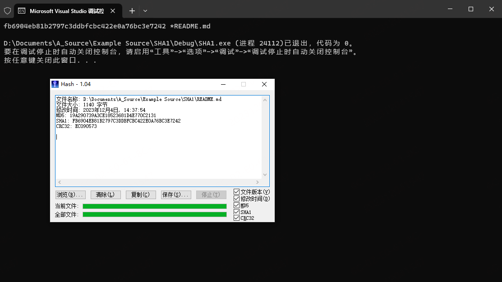

<h1 align="center">Welcome to SHA1 👋</h1>
<p>
  
</p>

> fork by [vog/sha1: SHA-1 implementation in C++. Do not use SHA-1 unless you have to! https://en.wikipedia.org/wiki/SHA-1#Birthday-Near-Collision\_Attack\_%E2%80%93\_first\_practical\_chosen-prefix\_attack](https://github.com/vog/sha1)


## 测试结果

计算 readme.md 文件的sha1



测试用例

```
Test:     abc
Result:   a9993e364706816aba3e25717850c26c9cd0d89d
Expected: a9993e364706816aba3e25717850c26c9cd0d89d  (OK)

Test:     abcdbcdecdefdefgefghfghighijhijkijkljklmklmnlmnomnopnopq
Result:   84983e441c3bd26ebaae4aa1f95129e5e54670f1
Expected: 84983e441c3bd26ebaae4aa1f95129e5e54670f1  (OK)

Test:     abcdefghbcdefghicdefghijdefghijkefghijklfghijklmghijklmnhijklmnoijklmnopjklmnopqklmnopqrlmnopqrsmnopqrstnopqrstu
Result:   a49b2446a02c645bf419f995b67091253a04a259
Expected: a49b2446a02c645bf419f995b67091253a04a259  (OK)

Test:     A million repetitions of 'a'
Result:   34aa973cd4c4daa4f61eeb2bdbad27316534016f
Expected: 34aa973cd4c4daa4f61eeb2bdbad27316534016f  (OK)

Test:     The quick brown fox jumps over the lazy dog
Result:   2fd4e1c67a2d28fced849ee1bb76e7391b93eb12
Expected: 2fd4e1c67a2d28fced849ee1bb76e7391b93eb12  (OK)

Test:     The quick brown fox jumps over the lazy cog
Result:   de9f2c7fd25e1b3afad3e85a0bd17d9b100db4b3
Expected: de9f2c7fd25e1b3afad3e85a0bd17d9b100db4b3  (OK)

Test:     No string
Result:   da39a3ee5e6b4b0d3255bfef95601890afd80709
Expected: da39a3ee5e6b4b0d3255bfef95601890afd80709  (OK)

Test:     Empty string
Result:   da39a3ee5e6b4b0d3255bfef95601890afd80709
Expected: da39a3ee5e6b4b0d3255bfef95601890afd80709  (OK)

Test:     abcde
Result:   03de6c570bfe24bfc328ccd7ca46b76eadaf4334
Expected: 03de6c570bfe24bfc328ccd7ca46b76eadaf4334  (OK)

Test:     Two concurrent checksum calculations
Result:   da39a3ee5e6b4b0d3255bfef95601890afd80709
Expected: da39a3ee5e6b4b0d3255bfef95601890afd80709  (OK)
Result:   a9993e364706816aba3e25717850c26c9cd0d89d
Expected: a9993e364706816aba3e25717850c26c9cd0d89d  (OK)

Test:     a [00] b [7F] c [80] d [FF] e [C3] [F0] f
Result:   cd0dd10814c0d4f9c6a2a0a4be2304d2371468d3
Expected: cd0dd10814c0d4f9c6a2a0a4be2304d2371468d3  (OK)
```


## Show your support

Give a ⭐️ if this project helped you!

***
_This README was generated with ❤️ by [readme-md-generator](https://github.com/kefranabg/readme-md-generator)_